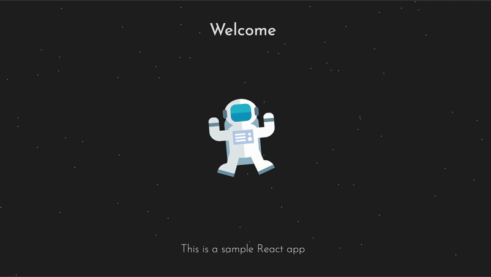
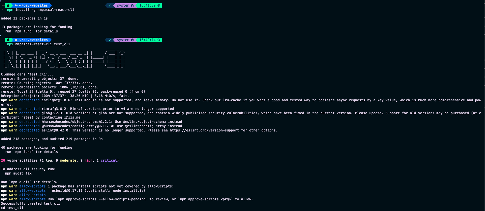

# React Boilerplate

> A lightweight front-end starter built with React, TypeScript, Vite, and Sass, designed to help you launch a clean and modular project quickly.

This starter ships with a minimal showcase screen and a structure ready to grow with components, helpers, interfaces, and shared styling layers.

<p align="center">
   
   <br>
   <em>Preview of the main welcome screen</em>
</p>

## Demo

- Local preview with Vite
- Production build generated by Vite
- Install CLI: [nmpascal-react-cli](https://www.npmjs.com/package/nmpascal-react-cli)

## Fast Bootstrap with CLI

You can generate a fresh project using this template in a single command with the official CLI tool.

<p align="center">
   
   <br>
   <em>Running the nmpascal-react-cli tool to clone and setup the template</em>
</p>

### Global Installation

```bash
npm install -g nmpascal-react-cli
nmpascal-react-cli <your-project-name>
```

## Key Features

- React 18 with TypeScript
- Vite development server and production build pipeline
- SCSS architecture with shared variables, mixins, keyframes, and global styles
- Component-based structure with a reusable welcome screen
- Helper layer for centralizing string access
- Typed interfaces for app contracts


## Tech Stack

- React 18
- TypeScript
- Vite
- Sass / SCSS

## Project Architecture

The codebase is organized by feature and responsibility:

- src/components: presentational UI modules
- src/helpers: small business or formatting helpers
- src/interfaces: shared TypeScript contracts
- src/utils: static data and reusable constants
- src/styles: SCSS modules and global style layers

## State Management

This template does not ship with global state management yet.

- App.tsx composes the main screen
- Welcome.tsx renders the animated landing view
- SettingsHelper exposes string lookup logic
- Static strings currently live in src/utils/constants.ts

## Data Layer

No remote data layer is configured in this template.

- UI content is currently local and static
- SettingsHelper reads from the in-memory strings object

Required environment variables:

- None for the current starter state

## UX/UI Highlights

- Full-screen welcome layout
- Animated star field and astronaut illustration
- Centralized text block for easy copy updates
- SCSS modules for scoped styling and reusable tokens

## Expected KPIs

This section is useful if you use this template as a launchpad for a product.

- Faster project bootstrap for new front-end builds
- Cleaner component separation from the first iteration
- Easier styling maintenance thanks to SCSS organization
- Lower setup time for teams that want a ready-made React starter

Tracking suggestions:

- Time to first feature added after bootstrap
- Number of reusable components extracted from the starter
- Build success rate across environments
- Lint error count over time

## Installation

Requirements:

- Node.js 18+
- yarn

1. Install dependencies:

```bash
yarn
```

2. Start the development server:

```bash
yarn dev
```

## Available Scripts

With yarn:

```bash
yarn dev      # start Vite dev server
yarn build    # compile TypeScript and build for production
yarn preview  # preview production build locally
yarn lint     # run ESLint
```

## Project Structure

```text
.
|- public/
|- src/
|  |- components/
|  |  |- Welcome.tsx
|  |  |- index.ts
|  |- helpers/
|  |  |- SettingsHelper.ts
|  |  |- index.ts
|  |- interfaces/
|  |  |- ISettingsHelperProps.ts
|  |  |- index.ts
|  |- styles/
|  |  |- _globals.scss
|  |  |- _keyframes.scss
|  |  |- _mixins.scss
|  |  |- _variables.scss
|  |  |- App.module.scss
|  |  |- main.module.scss
|  |  |- components/
|  |     |- Welcome.module.scss
|  |- utils/
|  |  |- constants.ts
|  |  |- index.ts
|  |- App.tsx
|  |- main.tsx
|  |- vite-env.d.ts
|- index.html
|- package.json
|- tsconfig.json
|- tsconfig.node.json
|- vite.config.ts
```

## Improvement Roadmap

- Add more reusable UI blocks and page sections
- Introduce form handling when the app grows beyond a static starter
- Add unit tests for helpers and component rendering
- Add responsive documentation screenshots in `.github/screenshots/`
- Extend the string layer or replace it with a proper i18n setup if needed

## Freelance Positioning

This template demonstrates:

- Ability to structure a clean React application from day one
- Clear separation between components, helpers, interfaces, and styling
- A maintainable SCSS setup for future product work
- A lightweight foundation that can evolve into a portfolio, dashboard, or client project

## Author

Pascal Hector (Akaï)

Freelance Web & Mobile Developer (TypeScript) | React & React Native / Expo / Cordova

This repository is shared as a starter project for future builds and client demos.